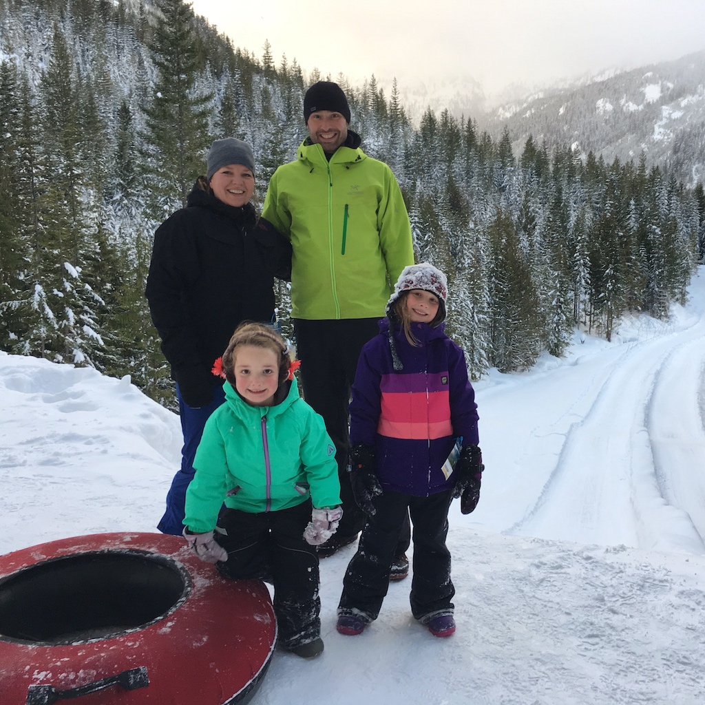
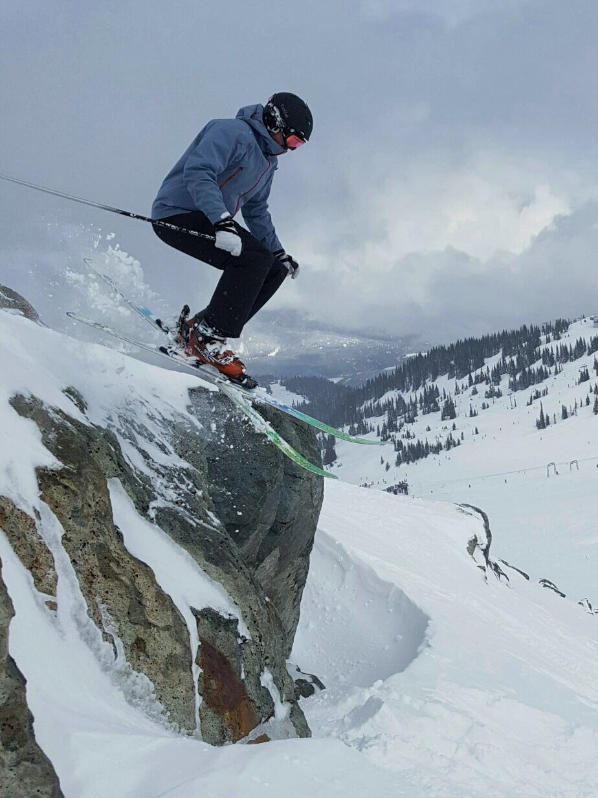
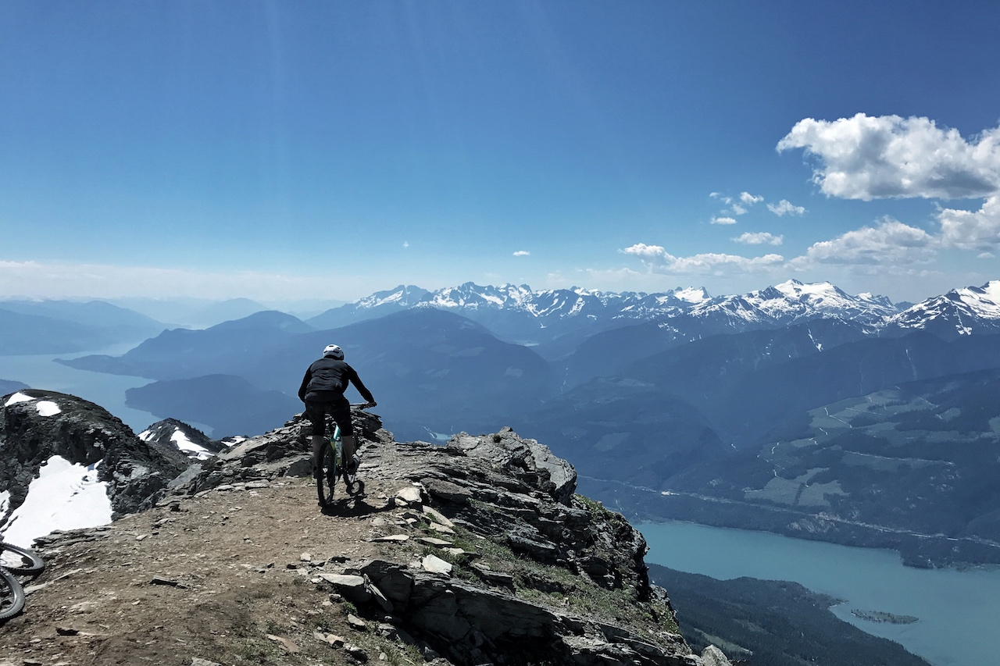

<h1>{{ page.title }}</h1>
<ul class="posts">

  
    <li>{{ post.date | date_to_string }} » <a href="{{ post.url }}" title="{{ post.title }}">{{ post.title }}</a></li>
  
</ul>

I am a Professor of Music and Humanities at [Quest University Canada](www.questu.ca) in Squamish, British Columbia. My book, Music and Ethical Responsibility, is published by Cambridge University Press. The book examines how musical experience creates encounters with other people that leads to ethical responsibilities. My main research interests include music and ethics, musical improvisation, meaning in music, soundscape, modern European philosophy, and psychology. I also do creative work including jazz composition, performance on double bass, and sound installations. One of my current research projects is called The Ethics of Timbre, which is funded by the Social Sciences and Humanities Research Council of Canada. Other recent work includes a sound sculpture commissioned for the London 2012 Cultural Olympiad. I have also done consulting in interdisciplinary and general education curriculum design. My PhD is in music and philosophy from Royal Holloway, University of London. Before moving to Quest in 2013, I spent nine years at [Trinity Western University](http://twu.ca/directory/faculty/jeff-warren.html), where I continue with the title of Adjunct Professor of Music and Interdisciplinary Arts.

I've taught all sorts of different courses, including: popular music history, 20th century art music history and analysis, ear training, foundational and capstone courses in interdisciplinary issues in the arts, jazz combo, and travel studies to London and Paris. In my tenure in TWU’s School of the Arts, Media and Culture I ran annual interdisciplinary conferences and was the founding editor of the academic journal “Verge: A journal of the arts and Christian faith.

I grew up in Ottawa, ON. Music was a part of my life early on, and my dad sang in a semi-professional choral group. After mixed experiences with the piano and trumpet, I picked up the bass guitar at age 15 for the reason most bass players get started: I wanted to start a band and I was the worst guitar player among my friends. That band eventually found its way on to a record small label in Kingston, ON. That group’s future was cut short for schooling, as I traveled across the country to study the double bass at Trinity Western University in Langley, B.C. I also played varsity volleyball, and after receiving his BA, I was offered to come and play a fifth year of volleyball. During that year I started an interdisciplinary MA in Religion, Culture, and Ethics. After completing that degree, I had the opportunity to teach and remained at TWU for nine years. Once I figured out that I enjoyed researching and writing about music as much as playing it, I decided to do a PhD at Royal Holloway, University of London in music and philosophy. I studied with Andrew Bowie and Nicholas Cook and my thesis title was “Musical Experience and Human Relationships: Meaning, Improvisation, and Ethics in Music”.

My applied musical work is quite varied, from studio session work to a new country band to the West Coast Symphony the nuevo flamenco group De La Terra. Jazz is the genre I perform most at present. At TWU I built and directed the jazz combo program. Then I spent a few years spending more time on creating sound installations for art galleries. I have also taught private lessons in my home studio, TWU, and Kwantlen Polytechnic University on double and electric bass, guitar, music theory, history, and composition. Since moving to Squamish, I have spent more time on other work, but I still play with a couple of different groups.

I currently reside in Squamish, British Columbia with my wife, two daughters, and little dog. I like to pretend I surf, but it is hard to really be a surfer when you only go a couple times a year, and the past few surf trips have ended with broken boards and feet full of urchins. Since moving to Squamish I mountain bike and ski, apparent requisites of living here.

You can take a look at a short version of my curriculum vitae [here](https://jeffrwarren.github.io/cvjeff). There are also links to some of my publications.

You can view my Quest University faculty bio [here](http://www.questu.ca/academics/faculty/jeff_warren.php).

